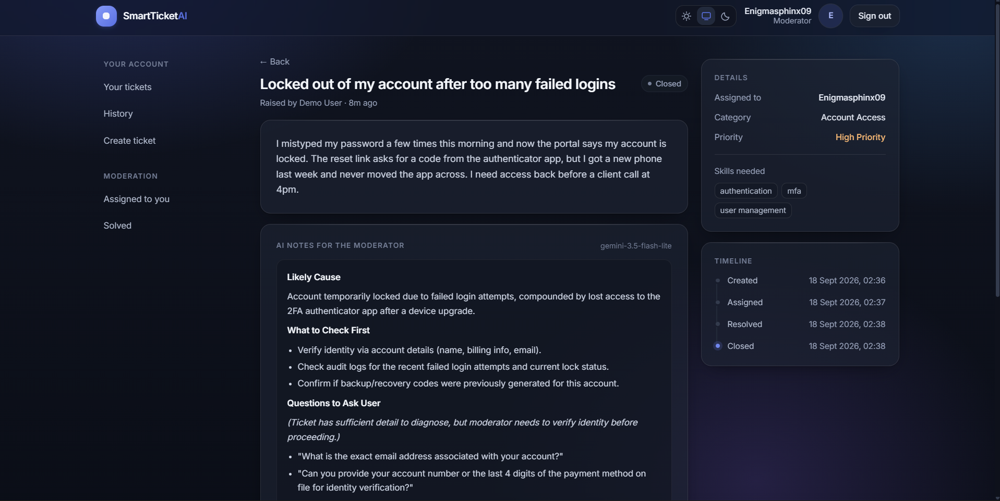
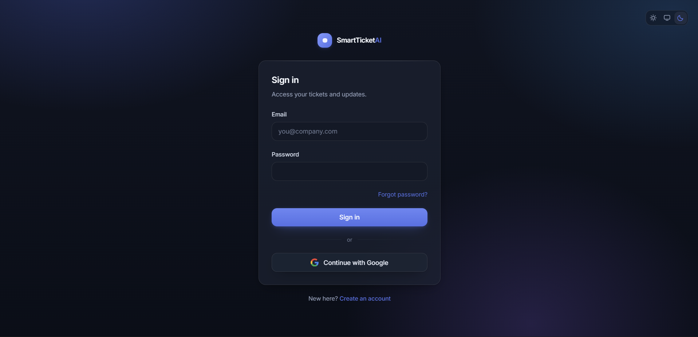
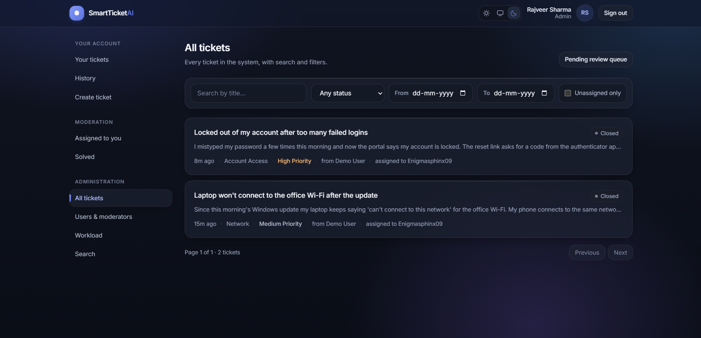
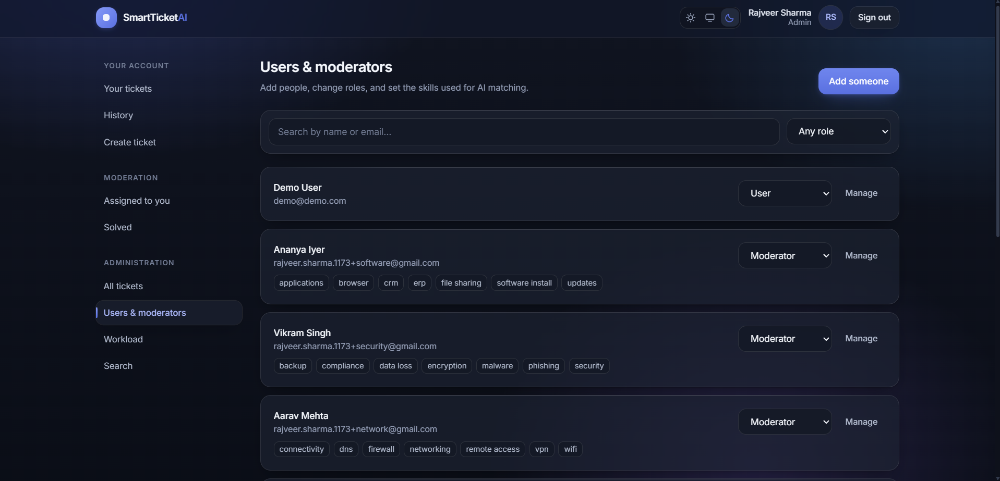
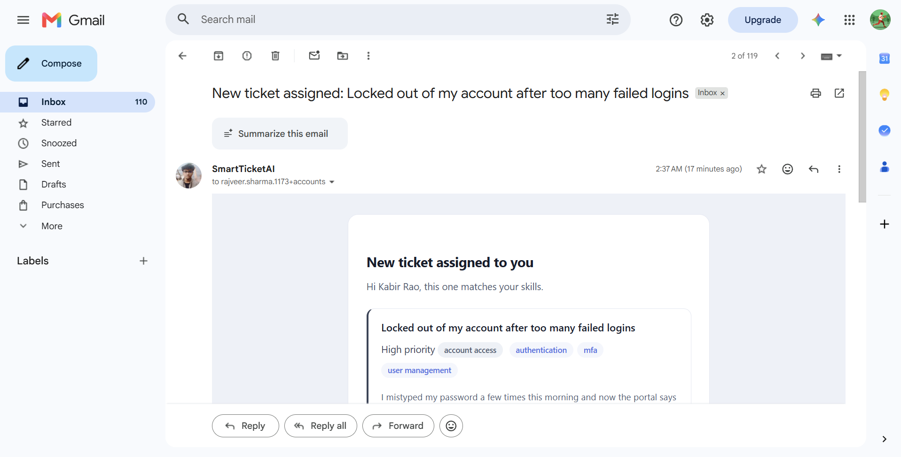

# SmartTicketAI

An event-driven support ticketing system that reads every incoming ticket with AI, writes
notes to help whoever picks it up, and routes it to the moderator whose skills actually fit.

The API saves a ticket and returns immediately — analysis, assignment and email all happen
as background jobs, each retried independently.

<p align="center">
  
</p>

---

## Contents

- [What it does](#what-it-does)
- [Screenshots](#screenshots)
- [How the AI agent works](#how-the-ai-agent-works)
- [Tech stack](#tech-stack)
- [Getting started](#getting-started)
- [Environment variables](#environment-variables)
- [Running the app](#running-the-app)
- [Tests](#tests)
- [Project structure](#project-structure)
- [Author](#author)

---

## What it does

### For the person raising a ticket

- Sign up with email and a 6-digit code, or with Google
- Raise a ticket, then follow it through Open → Assigned → In progress → Resolved → Closed
- Search their own tickets by title, status and date, with history kept separately
- Get an email at every step, plus a message when a moderator replies

### For moderators

- A queue of tickets assigned to them, and a separate list of what they've solved
- AI notes on every ticket: likely cause, what to check first, what to ask the user
- Move a ticket to In progress and then Resolved; reply to the person who raised it

### For admins

- Every ticket in the system, with filters and a Pending review queue for anything the AI
  couldn't route
- Add people, change roles, and set the skills used for matching
- Workload per moderator, and manual reassignment
- Search across tickets and people

### Throughout

- Role-based access enforced on every endpoint; tickets a person may not see return
  "not found" rather than "forbidden", so their existence isn't leaked
- AI notes are visible to the assigned moderator and admins — never to the person who
  raised the ticket
- Rotating refresh tokens with reuse detection: a stolen token ends every session

---

## Screenshots

### Sign in

Email and password, or Google. Access tokens live in memory only; the refresh token is an
httpOnly cookie.



### Ticket detail

What the assigned moderator sees: the ticket, the AI's category, priority and required
skills, the generated notes, and a timeline of everything that has happened.


### All tickets (admin)

Every ticket with search, status, date range and an unassigned-only filter.



### Users and moderators (admin)

Roles and the skills that drive AI matching. Role changes are staged until saved.



### Email notifications

Every notification is a designed HTML email — here, a moderator being told about a new
assignment, with the priority, category and skills as chips.



---

## How the AI agent works

```
User creates ticket
        │
        ▼  ticket/created
┌───────────────────────────────────────────────┐
│ 1. analyze      category, priority, skills    │
│ 2. write notes  markdown notes for moderator  │
│ 3. assign       best skill match, then least  │
│                 busy moderator                │
└───────────────────────────────────────────────┘
        │                        │
        ▼ ticket/assigned        ▼ ticket/status_changed
   email moderator            email the user
```

Each numbered step is a separate Inngest step, retried on its own, so a retry never repeats
work that already succeeded — and never re-sends an email.

### Model fallback

Models are tried strongest first, from `GEMINI_MODELS`. A model that returns a quota error
(HTTP 429) is recorded in the database and skipped until it resets, so later tickets don't
waste a call on it. If every model fails, the ticket is parked in **Pending review** and the
admins are emailed to assign it by hand.

### Skill matching

A required skill matches when it equals a moderator's skill, or when either contains the
other — so `vpn` matches a moderator listing `vpn troubleshooting`. Candidates are ranked by
number of matches first, then by how busy they are. With no match at all, the least busy
moderator gets it.

### Emails

Every send is recorded with an idempotency key of `{event_id}:{template}:{recipient}`, so a
retried job can't send the same email twice.

| Trigger | Goes to | Email |
| --- | --- | --- |
| Sign-up / password reset | The person | One-time code |
| Account created | The person | Welcome |
| Ticket assigned | Moderator | New ticket, with AI notes |
| Any status change | Ticket owner | Status update |
| Moderator replies after resolution | Ticket owner | New message |
| Nothing could be assigned | Admins | Needs manual assignment |

---

## Tech stack

| Layer | Choice |
| --- | --- |
| API | FastAPI, fully async |
| Database | PostgreSQL (Neon) with async SQLAlchemy 2.0 and Alembic |
| Auth | JWT access tokens, rotating refresh cookies, Google OAuth via Authlib, argon2 hashing |
| AI | Google Gemini with ordered model fallback |
| Background jobs | Inngest (Python SDK) |
| Email | Jinja2 HTML templates, sent over Gmail SMTP or the Brevo API |
| Frontend | React 19, TypeScript, Vite, Tailwind CSS 4, TanStack Query, React Router |
| Tests | pytest with pytest-asyncio — 104 tests against a real database |

---

## Getting started

### Prerequisites

- Python 3.12+
- Node.js 20+
- A PostgreSQL database (a free [Neon](https://neon.tech) project works)
- A [Google AI Studio](https://aistudio.google.com) API key
- A Gmail account with 2-step verification and an [App Password](https://support.google.com/accounts/answer/185833),
  or a [Brevo](https://brevo.com) API key for hosts that block SMTP
- Google OAuth credentials, if you want "Sign in with Google"

### Backend

```bash
cd backend
python -m venv .venv
.venv\Scripts\activate          # macOS/Linux: source .venv/bin/activate
pip install -e ".[dev]"
```

Create `backend/.env` using the table below, then set up the database:

```bash
alembic upgrade head            # create the schema
python -m scripts.seed_admin    # create the first admin from ADMIN_* in .env
```

### Frontend

```bash
cd frontend
npm install
```

### Background jobs

Inngest runs the AI agent and the emails. In development, start its dev server:

```bash
npx inngest-cli@latest dev -u http://127.0.0.1:8000/api/inngest
```

The dashboard at `http://127.0.0.1:8288` shows every run and each step inside it.

---

## Environment variables

Create `backend/.env`:

| Variable | What it is |
| --- | --- |
| `DATABASE_URL` | Postgres connection string. A Neon URL can be pasted as-is |
| `MIGRATION_DATABASE_URL` | Optional: Neon's direct (non-pooled) endpoint, used by Alembic |
| `TEST_DATABASE_URL` | Optional: a separate database for tests. **Tests drop and recreate its schema** |
| `JWT_SECRET` | Generate with `python -c "import secrets; print(secrets.token_urlsafe(64))"` |
| `GOOGLE_CLIENT_ID`, `GOOGLE_CLIENT_SECRET` | Google OAuth credentials |
| `GOOGLE_REDIRECT_URI` | `http://localhost:8000/api/auth/google/callback` |
| `GEMINI_API_KEY` | Google AI Studio key |
| `GEMINI_MODELS` | Comma-separated, strongest first |
| `EMAIL_PROVIDER` | `smtp` locally, `brevo` when the host blocks outbound SMTP |
| `BREVO_API_KEY` | Brevo API key, when `EMAIL_PROVIDER=brevo` |
| `MAIL_USERNAME`, `MAIL_PASSWORD` | Gmail address and App Password, when `EMAIL_PROVIDER=smtp` |
| `MAIL_FROM`, `MAIL_FROM_NAME` | Sender identity (both providers) |
| `MAIL_SERVER`, `MAIL_PORT` | `smtp.gmail.com`, `587` |
| `ADMIN_EMAIL`, `ADMIN_PASSWORD`, `ADMIN_NAME` | The first admin, created by the seed script |
| `INNGEST_DEV` | `1` locally; `0` with Inngest Cloud |
| `INNGEST_EVENT_KEY`, `INNGEST_SIGNING_KEY` | Inngest Cloud only |
| `FRONTEND_URL` | `http://localhost:5173` |

Add the redirect URI above to your Google OAuth client, and `http://localhost:5173` as an
authorized JavaScript origin.

---

## Running the app

Three terminals:

```bash
# 1 — API
cd backend && uvicorn app.main:app --reload

# 2 — background jobs
npx inngest-cli@latest dev -u http://127.0.0.1:8000/api/inngest

# 3 — frontend
cd frontend && npm run dev
```

| | |
| --- | --- |
| App | http://localhost:5173 |
| API docs | http://localhost:8000/docs |
| Health check | http://localhost:8000/api/health |
| Job dashboard | http://127.0.0.1:8288 |

Every backend route is served under `/api`, which Vite proxies in development — so the
browser sees one origin and the httpOnly refresh cookie works without cross-site rules.

---

## Tests

```bash
cd backend
pytest
```

104 tests covering authentication, OTP expiry and lockout, refresh-token rotation and reuse
detection, role-based access, the ticket lifecycle, admin actions, model fallback, skill
matching and email idempotency. Gemini and SMTP are always faked — no test spends quota or
sends mail.

Tests needing a database run only when `TEST_DATABASE_URL` is set, and they **drop and
recreate the schema**, so point it at a throwaway database.

---

## Project structure

```
backend/
  app/
    api/         routers: auth, tickets, moderator, admin, health
    core/        config, database, deps, errors, pagination, security
    models/      SQLAlchemy models
    schemas/     Pydantic request/response models
    services/    auth, tickets, admin, matching, notifications, ai_flow
    ai/          Gemini client with model fallback, prompts
    inngest/     background job definitions
    emails/      Jinja2 HTML email templates
  alembic/       migrations
  tests/
frontend/
  src/
    lib/         API client, auth context, query hooks, types
    components/  UI kit, layout, ticket list, markdown renderer
    pages/       auth, user, moderator, admin
Demo/            screenshots used in this README
```

---

## Author

**Rajveer Sharma**
